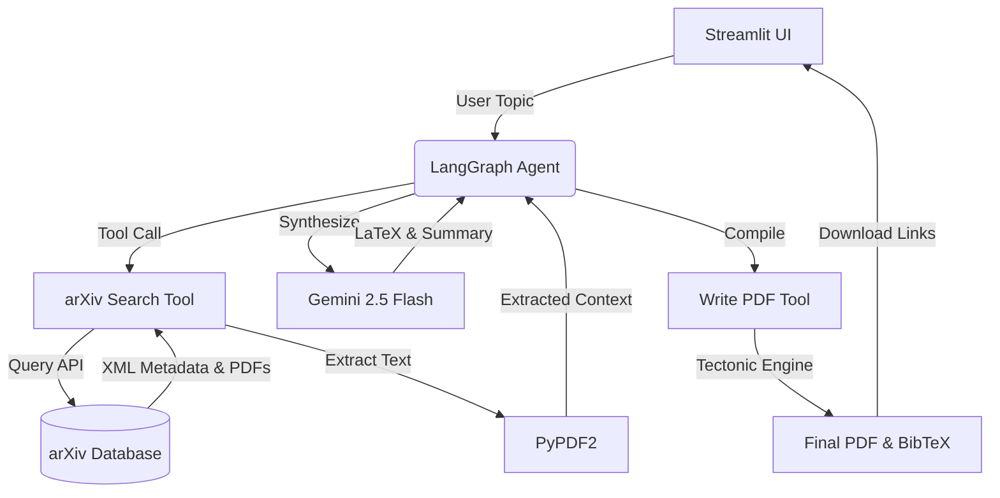
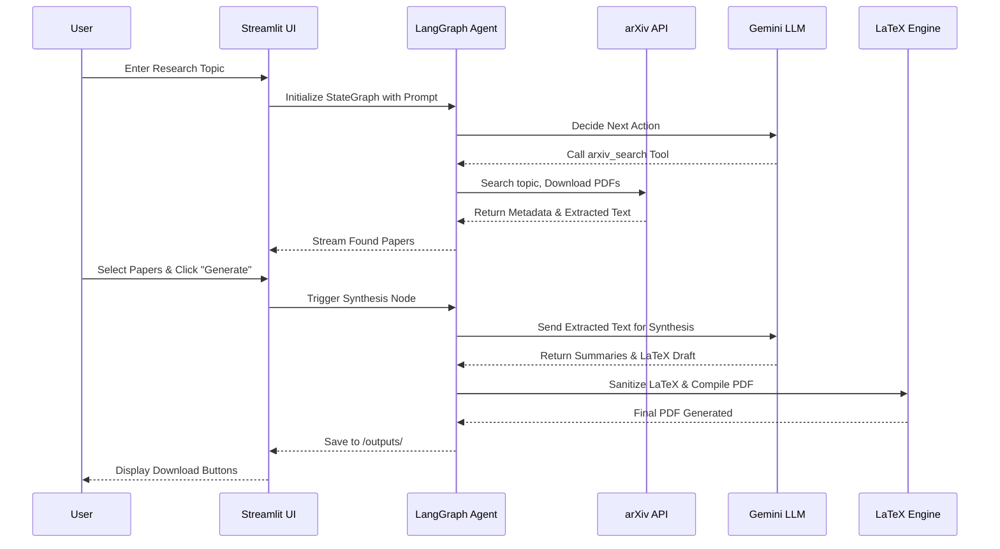

<!-- 1. Banner -->
<div align="center">
  
</div>

<!-- 2. Project Title -->
# 🧠 Agentic AI Researcher

<!-- 3. Short Description -->
> **An autonomous AI agent pipeline that researches topics, retrieves academic papers, synthesizes information, and generates publication-ready LaTeX PDFs.**

<!-- Badges -->
<div align="center">
  
  
  
  
  
</div>

---

## 📖 4. Overview
**Agentic AI Researcher** is an autonomous, end-to-end research assistant powered by **LangGraph** and **Google Gemini 2.5 Flash**. It accepts a research topic, autonomously searches the **arXiv** database for relevant literature, downloads and parses PDFs, synthesizes the core findings, and automatically drafts a fully formatted academic paper in **LaTeX and PDF** formats. 

Built for researchers, academics, and AI enthusiasts, this project demonstrates the power of Agentic AI workflows in automating tedious literature reviews and document generation tasks.

---

## 🧐 5. Problem Statement
In the modern academic and technical landscape:
- **Manual research is time-consuming:** Finding, downloading, and reviewing dozens of papers takes days or weeks.
- **Reading multiple research papers is difficult:** Extracting the signal from the noise across complex, dense PDFs is mentally taxing.
- **Information is scattered across documents:** Correlating findings and methodologies from different authors requires immense organization.
- **Writing literature reviews requires significant effort:** Structuring findings into a cohesive narrative with proper citations is a massive bottleneck.
- **Researchers need an intelligent research assistant:** A system to automate the grunt work of literature discovery, synthesis, and formatting, freeing humans to focus on novelty and critical analysis.

---

## 💡 6. Proposed Solution
This repository solves the academic research bottleneck using **Agentic AI**.

When a user provides a research topic, the AI:
1. **Plans the workflow:** Uses LangGraph to orchestrate a stateful, autonomous research pipeline.
2. **Searches papers:** Interfaces with the arXiv API to find the most relevant papers using dynamic search terms (phrase, AND, OR queries).
3. **Processes PDFs:** Automatically downloads the source PDFs and extracts text using PyPDF2.
4. **Extracts information:** Curates up to 10 of the most relevant papers and extracts large text chunks for analysis.
5. **Summarizes findings:** Prompts the Gemini model to synthesize insights from the extracted literature.
6. **Generates structured reports:** Drafts a complete academic paper containing an abstract, introduction, methodology, findings, and conclusion.
7. **Compiles LaTeX to PDF:** Generates a `.tex` file, creates a `references.bib` BibTeX file, and compiles them into a polished PDF using the Tectonic typesetting engine.

---

## ✨ 7. Key Features
- **Autonomous Agent Workflow:** Built with LangGraph for stateful execution, tool calling, and deterministic end-to-end flows.
- **arXiv API Integration:** Multi-strategy querying to find the most relevant academic literature.
- **Automated PDF Parsing:** Hands-free downloading and text extraction of arXiv research papers.
- **Interactive Streamlit UI:** A clean, responsive web interface to input topics, monitor agent reasoning, select specific papers, and download generated artifacts.
- **LaTeX & PDF Generation:** Outputs fully structured `.tex` documents and compiles them using Tectonic.
- **Resilient API Handling:** Implements exponential backoff and retry logic to gracefully handle LLM rate limits and `RESOURCE_EXHAUSTED` errors.
- **Citation Generation:** Automatically structures BibTeX entries (`references.bib`) for all cited papers.

---

## 🏗 8. System Architecture

The architecture consists of loosely coupled modules orchestrated by LangGraph:
- **Streamlit UI (`app.py`):** The frontend interface. Manages session state, chat history, and displays the paper selection panel and final outputs.
- **AI Agent (`ai_agent.py`):** The LangGraph core. Defines the state machine, invokes the Gemini LLM, determines whether to use tools or synthesize, and orchestrates the entire loop.
- **Gemini Integration:** Powered by `gemini-2.5-flash` via `langchain-google-genai` for reasoning, tool calling, and summarization.
- **arXiv Search (`tools/arxiv_tool.py`):** A custom tool that queries arXiv, parses XML results, deduplicates entries, downloads PDFs, and extracts text.
- **PDF Reader (`tools/read_pdf.py`):** Utility tool for extracting text from raw PDF bytes.
- **LaTeX Compiler (`tools/write_pdf.py`):** Generates LaTeX code, sanitizes LLM artifacts, and compiles the final PDF using Tectonic via `subprocess`.



---

## 🔄 9. Complete Workflow



---

## 🧠 10. Agentic AI Pipeline

The pipeline leverages **LangGraph** to maintain a typed state (`State`) containing chat messages, paper context, and user-selected papers. 
- **Decision-Making:** The agent evaluates the current state. If a tool call is requested (e.g., searching arXiv), it routes to the `tools` node. If papers have been selected for final generation, or if the research phase is complete, it routes to the `synthesize` node.
- **Tool Calling:** The `arxiv_search` tool dynamically expands queries if initial results are low, downloads the physical PDFs, and extracts raw text context directly into the agent's memory payload.
- **Reasoning Process:** Gemini uses the extracted texts as grounded context to prevent hallucinations. It adheres to strict system prompts commanding it to synthesize rather than regurgitate.
- **Resilience:** The `call_model` function acts as a wrapper around the Gemini API, intercepting rate-limit errors and applying an exponential backoff strategy (35s, 70s, 105s).

---

## 📁 11. Project Structure

```text
Agentic-AI-Researcher-main/
│
├── app.py                     # Streamlit frontend & session management
├── ai_agent.py                # LangGraph state machine, LLM setup, and synthesis logic
├── pyproject.toml             # uv package dependencies and project metadata
├── uv.lock                    # Dependency lockfile for reproducible builds
├── .env                       # (Ignored) Environment variables (API Keys)
│
├── tools/                     # Agent Tools Directory
│   ├── arxiv_tool.py          # arXiv API querying, PDF downloading, text extraction
│   ├── read_pdf.py            # PDF reading utility
│   ├── write_pdf.py           # LaTeX sanitization and Tectonic compilation
│   ├── paper_results.py       # Dataclass/dict builders for search results
│   ├── debug_stream.py        # Utility for debugging LangGraph streams
│   └── test_arxiv_tool.py     # Unit tests for arXiv integration
│
├── outputs/                   # Generated artifacts (created at runtime)
│   └── {topic_slug}/          # Directory per research topic
│       ├── pdfs/              # Raw downloaded arXiv PDFs
│       ├── texts/             # Raw extracted text from PDFs
│       ├── paper.pdf          # Final compiled research paper
│       ├── paper.tex          # Generated LaTeX source
│       ├── references.bib     # Generated BibTeX citations
│       ├── research_notes.md  # Markdown summary of findings
│       └── pipeline.log       # Execution trace logs
│
└── Example of Generated Doc/  # Sample outputs for demonstration
```

---

## 🛠 12. Tech Stack

| Category | Technologies |
|---|---|
| **Programming Language** | Python 3.12+ |
| **Frontend** | Streamlit |
| **AI / LLM** | Google Gemini 2.5 Flash, LangChain, LangGraph |
| **APIs** | arXiv API |
| **PDF Processing** | PyPDF2 |
| **Document Generation** | LaTeX, Tectonic (Typesetting Engine) |
| **Dependency Management** | `uv` |

---

## ⚙️ 13. Installation

**Step 1: Clone the repository**
```bash
git clone https://github.com/PranavSriram39/Agentic-AI-Researcher.git
cd Agentic-AI-Researcher
```

**Step 2: Install `uv` (Fast Dependency Manager)**
```bash
pip install uv
```

**Step 3: Sync Dependencies**
```bash
uv sync
```
*This automatically resolves and installs dependencies from `pyproject.toml` into an isolated virtual environment.*

---

## 📋 14. Prerequisites
- **Python 3.12** or higher.
- **Tectonic LaTeX Engine:** Required for compiling the generated `.tex` files into PDFs.
  - *Windows (Admin PowerShell):*
    ```powershell
    [System.Net.ServicePointManager]::SecurityProtocol = [System.Net.ServicePointManager]::SecurityProtocol -bor 3072
    iex ((New-Object System.Net.WebClient).DownloadString('https://drop-ps1.fullyjustified.net'))
    ```
  - *macOS:* `brew install tectonic`
  - *Linux:* `cargo install tectonic`
- **Google Gemini API Key:** Obtainable from [Google AI Studio](https://aistudio.google.com/).

---

## 🔐 15. Environment Variables

Create a `.env` file in the root directory and add the following variable:

```env
GEMINI_API_KEY="your_google_gemini_api_key_here"
```

Alternatively, set it in your terminal:
- **Windows:** `setx GEMINI_API_KEY "your_key"`
- **Linux/Mac:** `export GEMINI_API_KEY="your_key"`

---

## 🚀 16. Running the Project

Start the Streamlit application:

```bash
uv run streamlit run app.py
```

The application will launch in your default web browser (usually at `http://localhost:8501`).

---

## 📸 17. Screenshots

<div align="center">

| Home Page & Topic Input | Paper Selection Panel |
| :---: | :---: |
|  |  |

| LaTeX Compilation & Output | Generated Research Report |
| :---: | :---: |
|  |  |

</div>
*(Replace placeholder images with actual UI screenshots)*

---

## 🔌 18. API Documentation

### **arXiv API**
- **Endpoint:** `https://export.arxiv.org/api/query`
- **Request Flow:** The `arxiv_tool.py` constructs dynamic query strings using `ti:` (title), `abs:` (abstract), and `all:` fields, supporting logical `AND`/`OR` operations. It requests up to 25 results, sorted by descending submission date.
- **Response Flow:** Returns an Atom XML feed. The agent parses `atom:entry` nodes for titles, authors, summaries, and PDF download links.
- **Error Handling:** If the API returns a 400 or fails, the tool gracefully catches the exception, logs it, and attempts fallback queries with simplified terminology.

---

## 🔬 19. Methodology

1. **Query Normalization:** User topics are sanitized into robust arXiv query structures.
2. **Document Retrieval:** PDFs are fetched directly from arXiv servers.
3. **Information Extraction:** `PyPDF2` strips text from binary PDFs. The text is truncated to ~30,000 characters to fit within the Gemini model's context window.
4. **Contextual Grounding:** The LLM is prompted with the extracted texts and forced to synthesize rather than hallucinate external knowledge.
5. **LaTeX Sanitization:** LLM-generated LaTeX often contains formatting errors or escaped characters (e.g., `\\textbf`). The `write_pdf.py` tool sanitizes the raw output and wraps it in a standard LaTeX template if necessary before compiling.

---

## ⚠️ 20. Challenges Faced

- **LLM Rate Limits:** Free-tier AI models frequently hit `RESOURCE_EXHAUSTED` (429) errors when processing heavy PDF contexts. **Solution:** Implemented a robust exponential backoff retry system in `ai_agent.py` to pause and retry execution automatically.
- **LaTeX Compilation Errors:** LLMs often generate invalid LaTeX syntax, causing compilation to crash. **Solution:** Created a robust `_sanitize_latex` regex pipeline to clean up standard markdown artifacts, replace improper quotes, and ensure document environments are closed correctly.
- **arXiv Search Accuracy:** Single-phrase queries on arXiv often yield zero results. **Solution:** Developed a multi-tier search strategy that tries phrase matching, token `AND` matching, token `OR` matching, and synonym expansion until enough papers are found.

---

## 📊 21. Performance

- **End-to-End Latency:** 2–5 minutes per full report (dependent on the number of PDFs downloaded and Gemini API response times).
- **PDF Extraction Speed:** Parses standard arXiv preprints (10-20 pages) in under 2 seconds locally.
- **Context Handling:** Successfully processes and synthesizes up to 10 parsed papers per generation cycle.

---

## 🔮 22. Future Enhancements

- [ ] **Retrieval-Augmented Generation (RAG):** Integrate a Vector Database (e.g., ChromaDB or FAISS) to chunk and semantically search entire PDFs instead of truncating text.
- [ ] **Multi-Agent Collaboration:** Split the monolithic agent into a Planner, Researcher, Writer, and Reviewer (e.g., using CrewAI or AutoGen paradigms).
- [ ] **Citation Validation:** Add a verification pass to ensure every inline citation maps correctly to the bibliography.
- [ ] **Interactive Chat with Reports:** Allow users to chat directly with the generated document to ask follow-up questions.
- [ ] **Additional Databases:** Integrate PubMed, IEEE Xplore, or Semantic Scholar APIs.

---

## 🌐 23. Deployment Guide

To deploy this Streamlit app locally or on a cloud provider (e.g., Streamlit Community Cloud, Render, or Railway):

1. **Docker (Recommended for Cloud):**
   You will need a Dockerfile that installs `tectonic` alongside Python.
   ```dockerfile
   FROM python:3.12-slim
   RUN apt-get update && apt-get install -y curl
   RUN curl --proto '=https' --tlsv1.2 -fsSL https://drop-sh.fullyjustified.net | sh
   RUN pip install uv
   WORKDIR /app
   COPY . .
   RUN uv sync
   CMD ["uv", "run", "streamlit", "run", "app.py", "--server.port=8501", "--server.address=0.0.0.0"]
   ```
2. **Environment Configuration:** Ensure `GEMINI_API_KEY` is set in your host's secure environment secrets.

---

## 📚 24. Learning Outcomes
Developers exploring this repository will learn how to:
- Construct **stateful agent architectures** using LangGraph.
- Bind and orchestrate Python **Tools** for LLM execution.
- Interact programmatically with the **arXiv API** and parse complex XML.
- Perform **automated text extraction** from binary PDF files.
- Programmatically **compile LaTeX** using subprocesses and handle formatting anomalies.
- Build reactive, async-friendly UIs with **Streamlit**.

---

## 🗺 25. Roadmap

- [x] Initial LangGraph Pipeline Setup
- [x] Streamlit Frontend Integration
- [x] arXiv Search & PDF Download Tool
- [x] LaTeX to PDF Compilation Tool
- [x] LLM Rate Limit Handling
- [ ] RAG / Vector DB Integration
- [ ] Multi-Agent Collaboration Support

---

## 🤝 26. Contributing

Contributions are welcome! If you'd like to improve the LaTeX generation, add new databases, or enhance the UI:
1. Fork the repository.
2. Create a feature branch (`git checkout -b feature/AmazingFeature`).
3. Commit your changes (`git commit -m 'Add some AmazingFeature'`).
4. Push to the branch (`git push origin feature/AmazingFeature`).
5. Open a Pull Request.

---

## 📄 27. License

This project is licensed under the **MIT License**. See the `LICENSE` file for more details.

---

## ✍️ 28. Author

**Pranav Sriram**  
- GitHub: [@PranavSriram39](https://github.com/PranavSriram39)  
- LinkedIn: [Your LinkedIn Profile](https://linkedin.com/in/placeholder) 

---
<div align="center">
  <i>Built with ❤️ using LangGraph, Gemini, and Streamlit.</i>
</div>
